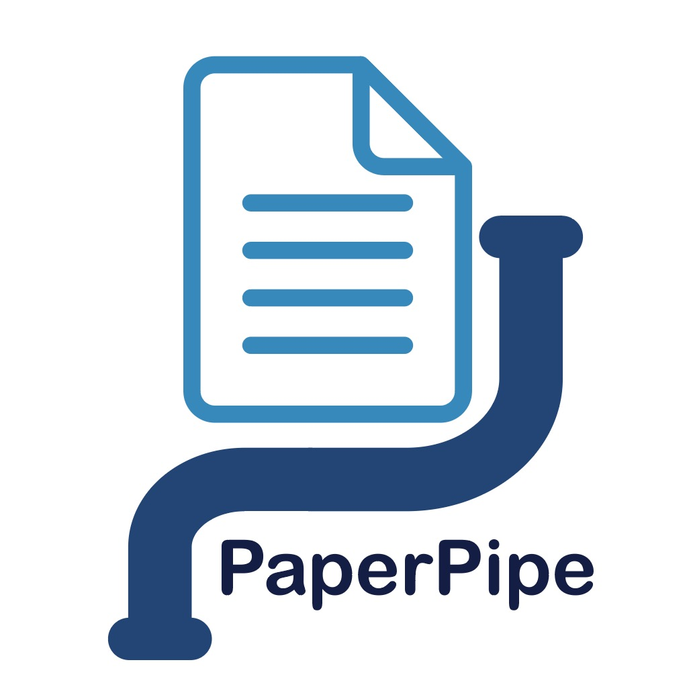

# 
Toolkit for processing academic papers through customizable pipelines. Features include:
- PDF/HTML parsing with section extraction
- LLM-based paper classification
- Initially focused on PV degradation literature
- Extensible design for other research domains
- More features planned

Originally developed for solar cell degradation research, but designed as a general-purpose academic paper processing framework.
